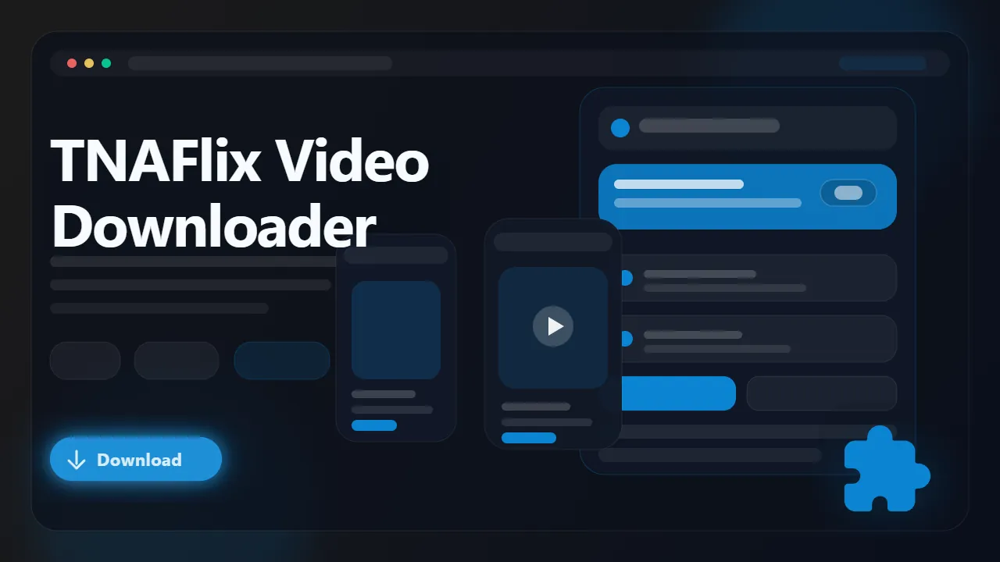

# TNAFlix Downloader (Browser Extension)

> Download supported TNAFlix videos as MP4 files directly from active watch pages.

TNAFlix Downloader is a browser extension built for users who want a cleaner way to save supported TNAFlix videos for offline viewing. It detects the active media source from the page, surfaces available quality variants when present, and exports the final result as MP4 without forcing you to inspect page scripts or use separate extraction tools.

- Save supported TNAFlix videos from watch pages
- Detect available quality options exposed by the player
- Export MP4 files for easier offline playback
- Avoid manual URL extraction and stream hunting
- Keep the process browser-native

## Links

- :rocket: Get it here: [TNAFlix Downloader](https://serp.ly/tnaflix-video-downloader)
- :new: Latest release: [GitHub Releases](https://github.com/serpapps/tnaflix-video-downloader/releases/latest)
- :question: Help center: [SERP Help](https://help.serp.co/en/)
- :beetle: Report bugs: [GitHub Issues](https://github.com/serpapps/tnaflix-video-downloader/issues)
- :bulb: Request features: [Feature Requests](https://github.com/serpapps/tnaflix-video-downloader/issues)

## Preview

## Table of Contents

- [Why TNAFlix Downloader](#why-tnaflix-downloader)
- [Features](#features)
- [How It Works](#how-it-works)
- [Step-by-Step Tutorial: How to Download Videos from TNAFlix](#step-by-step-tutorial-how-to-download-videos-from-tnaflix)
- [Supported Formats](#supported-formats)
- [Who It's For](#who-its-for)
- [Common Use Cases](#common-use-cases)
- [Troubleshooting](#troubleshooting)
- [Trial & Access](#trial--access)
- [Installation Instructions](#installation-instructions)
- [FAQ](#faq)
- [License](#license)
- [Notes](#notes)
- [About TNAFlix](#about-tnaflix)

## Why TNAFlix Downloader

TNAFlix video pages can expose several page assets around the player, which makes generic download tools inconsistent. A simple scan often returns the wrong file or misses the active playback source entirely once the page finishes initializing.

TNAFlix Downloader is built to simplify that. Open the watch page, let the extension detect the supported video source, choose the quality you want, and export the result as MP4.

## Features

- Detects supported TNAFlix video sources from multiple methods (config XML, API, HTML5 video)
- Lists available quality variants when present
- In-page download button built into the video player
- Converts HLS streams to downloadable MP4 files in-browser
- Right-click context menu for a faster download flow
- Real-time progress tracking with download speed and file size
- Desktop notifications when downloads complete
- Auto-saves to an organized TNAFLIX subfolder in Downloads
- Exports MP4 files for simpler offline viewing
- Cross-browser support for Chrome, Edge, Brave, Opera, Firefox, Whale, and Yandex

## How It Works

1. Install the extension from the latest release.
2. Open a TNAFlix video page and press play.
3. Let the extension detect the active media source.
4. Open the popup or use the in-page download button.
5. Choose the quality or stream option you want.
6. Start the download and wait for the MP4 export to finish.
7. Save the final MP4 file locally.

## Step-by-Step Tutorial: How to Download Videos from TNAFlix

1. Install TNAFlix Downloader from the latest GitHub release.
2. Open TNAFlix and sign in if the page requires account access.
3. Navigate to the video page you want to keep.
4. Let the player load fully and press play.
5. Click the in-page download button on the player or open the extension popup.
6. Review the quality options shown by the extension.
7. Choose the resolution you want if multiple options are available.
8. Start the download and wait for the MP4 export to finish.
9. Open the saved file from your Downloads folder.

## Supported Formats

- Input: supported TNAFlix video sources (HLS, direct MP4, config XML)
- Input: multiple quality levels from the page source
- Output: MP4

Saved files use MP4 so they are easier to replay on standard media players, transfer between devices, or archive for later access.

## Who It's For

- TNAFlix viewers who want offline copies of supported videos
- Users who prefer a browser extension over manual extraction
- People archiving videos they can already access in the browser
- Users who want a cleaner MP4 save workflow
- Anyone who wants to avoid command-line tools or desktop software for downloads

## Common Use Cases

- Save a TNAFlix video for later viewing
- Export the highest available quality as MP4
- Avoid manually parsing playback source URLs
- Keep local copies for offline playback
- Download the best quality exposed by the page

## Troubleshooting

**The extension does not detect the video**
Start playback first and wait for the player to initialize the active source.

**Only one source is listed**
Some pages expose only one usable stream, so only one option may appear.

**The wrong source shows up**
Refresh the page and retry after playback starts again.

**The download stopped or failed partway through**
Check whether your internet connection dropped during the export. Retry the download from the popup.

**The page requires account access**
The extension only works on media you can already open and play in your active browser session.

## Trial & Access

- Includes **3 free downloads** so you can test the workflow first
- Email sign-in uses secure one-time password verification
- No credit card required for the trial
- Unlimited downloads are available with a paid license

Start here: [https://serp.ly/tnaflix-video-downloader](https://serp.ly/tnaflix-video-downloader)

## Installation Instructions

1. Open the latest release page: [GitHub Releases](https://github.com/serpapps/tnaflix-video-downloader/releases/latest)
2. Download the correct build for your browser.
3. Install the extension.
4. Open a TNAFlix video page.
5. Use the popup to detect and download the media.

## FAQ

**Can I download TNAFlix videos as MP4?**
Yes. Supported downloads are exported as MP4 files.

**Do I need extra software?**
No. The workflow runs entirely in the browser extension.

**Does it work on every page?**
It works on supported playback flows. Detection depends on how the active page exposes the media source.

**Where are videos saved?**
They are saved to your default Downloads location, typically inside a TNAFLIX subfolder.

**What browsers are supported?**
Chrome, Edge, Brave, Opera, Firefox, Whale, and Yandex.

**Is my data safe?**
Yes. Video processing happens entirely in your browser. Authentication uses secure OTP verification.

## License

This repository is distributed under the proprietary SERP Apps license in the [LICENSE](LICENSE) file. Review that file before copying, modifying, or redistributing any part of this project.

## Notes

- Only download content you own or have explicit permission to save
- An internet connection is required for downloads
- Must press play before the extension can detect the video
- Quality depends on the source and what the page exposes
- Video data is served through multiple backend APIs, which the extension handles automatically

## About TNAFlix

TNAFlix is a video platform with player-managed playback and multiple media assets around many watch pages. TNAFlix Downloader is built to make supported downloads easier for users who already have access to those videos in the browser.
